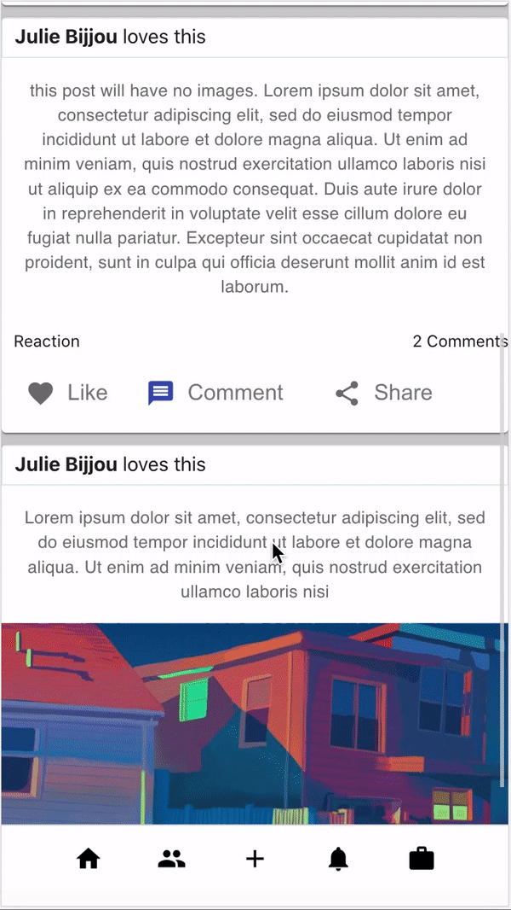

# social-network-lite
a simple fullstack social networking application

# how to build
1. build docker images `docker-compose build`
2. start the containers `docker-compose up`

now go to your browser and go to url `localhost:4001`

